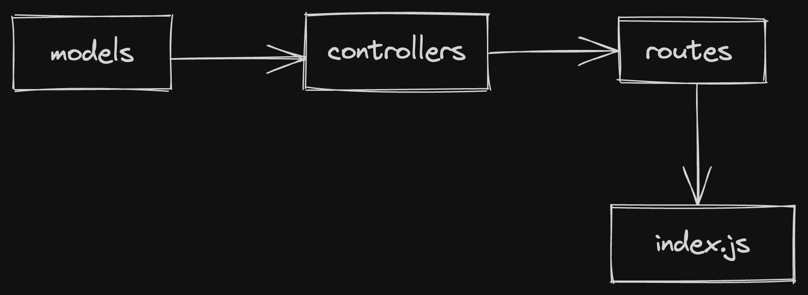

Technology: Express, MongoDB  

---

Frontend [here.](https://github.com/webintellectual/To-Do-App-Frontend)  

---

### DIRECTORY GUIDE:

**Package.json** : It keeps dependencies of modules that we install.

**node_modules** folder keep the modules that we installed in backend folder.

---
**models**:
- Here we create database models. 
- Schema of database is defined.

**controllers**:
- logic to make CRUD requests on database is written here.
- models are imported and logic is written on them

**routes**:
- Here we make actual CRUD requests
- controlllers are imported and used to make requests.

**index.js** :
- It is the main entry point of our backend code.
- Backend app instance is created heres
- routes are imported here and added as use functionality in the app instance. 

 

